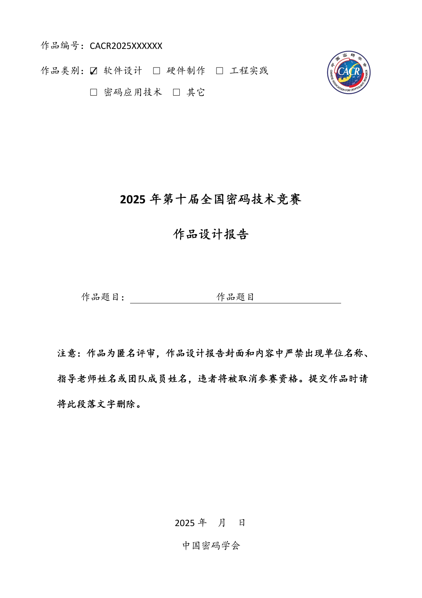

<div align="center">
  

  # 2025 全国密码技术竞赛 LaTeX 模板

  基于第十届全国密码技术竞赛官方 Word 模板整理

  [](https://www.latex-project.org/)
  [](LICENSE)
</div>

> 非官方社区模板。提交前请以当届组委会发布的官方文件为准。

## 预览

<div align="center">
  
</div>

## 使用

打开 `template.tex`，修改文件顶部的作品编号、题目、日期、摘要和五个关键词：

```latex
\newcommand{\WorkNumber}{CACR2025XXXXXX}
\newcommand{\WorkTitle}{作品题目}
\newcommand{\ReportDate}{2025年\quad 月\quad 日}
\newcommand{\WorkAbstract}{作品内容摘要}
\newcommand{\WorkKeywords}{关键词一；关键词二；关键词三；关键词四；关键词五}
```

选择作品类别时，仅将对应选项设为 `true`。正式提交前，将
`\TemplateHintstrue` 改为 `\TemplateHintsfalse`，并删除封面的匿名评审提醒。

## 编译

推荐使用 TeX Live 2024 或更新版本：

```bash
latexmk -xelatex template.tex
```

Overleaf 中将主文件设为 `template.tex`，编译器选择 **XeLaTeX**。

模板在 Windows 中优先使用官方 Word 文件指定的宋体、华文楷体、黑体、
楷体、Calibri 和 Times New Roman；缺少这些字体时会自动使用开源近似字体。

## 注意事项

- 页面为 A4，四边页边距 2 cm。
- 作品类别、正文标题和基本信息表已按 2025 官方模板更新。
- 官方 Word 模板封面使用“密码应用技术”，基本信息表使用“密码技术应用”；本模板分别保留原文。
- 封面和正文不得出现单位、指导老师或团队成员姓名。
- `template.pdf` 为编译效果示例。

本项目派生自 [Reverier-Xu/CACRcomp-latex](https://github.com/Reverier-Xu/CACRcomp-latex)，
按照 [MIT License](LICENSE) 开源。
