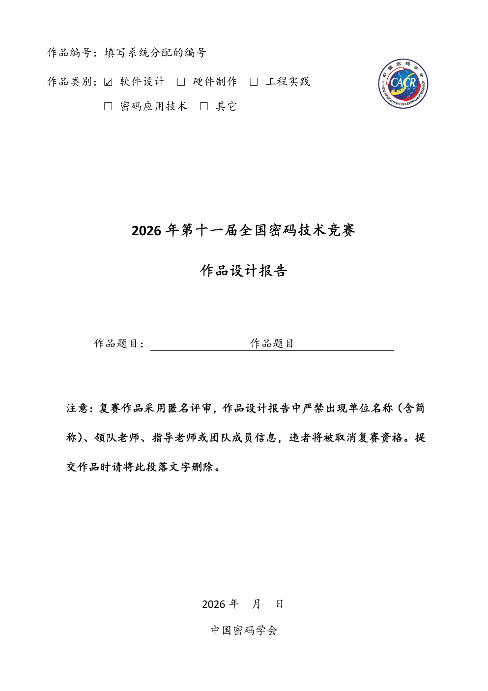

<div align="center">
  

  # 2026 全国密码技术竞赛 LaTeX 作品设计报告模板

  第十一届全国密码技术竞赛 · 非官方社区模板
</div>

本项目以所附《附件二---作品设计报告（模板）.docx》的页面、封面、基本信息表和正文栏目为基础，并依据[2026 年复赛通知](https://www.chinacodes.com.cn/news/lookAllNews.do)更新年份和届次。所附 Word 文件封面仍写着“2025 年第十届”；最终提交要求以组委会当届发布的附件为准。



## 使用

在 `template.tex` 顶部填写系统自动分配的作品编号、题目、日期、摘要和五个关键词，并将对应作品类别设为 `true`，其余设为 `false`。正文标题可按作品内容增删。

```latex
\newcommand{\WorkNumber}{填写系统分配的编号}
\newcommand{\WorkTitle}{作品题目}
\newcommand{\ReportDate}{2026年\quad 月\quad 日}
```

模板默认显示填写提示。提交前将 `\TemplateHintstrue` 改为 `\TemplateHintsfalse`，并检查封面、正文和支撑材料均不含单位及团队身份信息。2026 年复赛通知规定，设计报告文件名为“编号-2026密码竞赛复赛作品设计报告”，首页须填写系统生成的编号。

## 编译

使用 XeLaTeX，运行 `latexmk -xelatex template.tex`；在 Overleaf 中将 `template.tex` 设为主文件并选择 XeLaTeX。`template.pdf` 是示例预览。

页面为 A4，四边页边距 2 cm。封面类别沿用 Word 文件的“密码应用技术”，基本信息表沿用其“密码技术应用”。缺少宋体、楷体等系统字体时，源码会自动选用开源近似字体。

本项目派生自 [Reverier-Xu/CACRcomp-latex](https://github.com/Reverier-Xu/CACRcomp-latex)，按 [MIT License](LICENSE) 开源。
